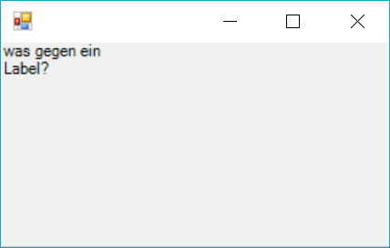
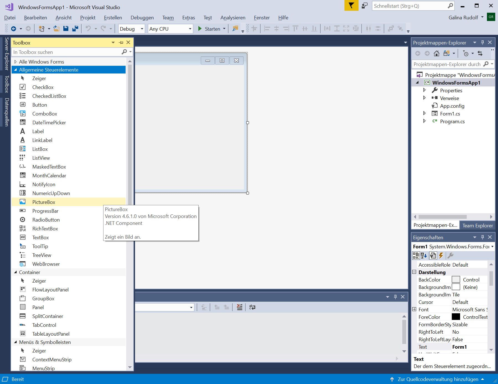
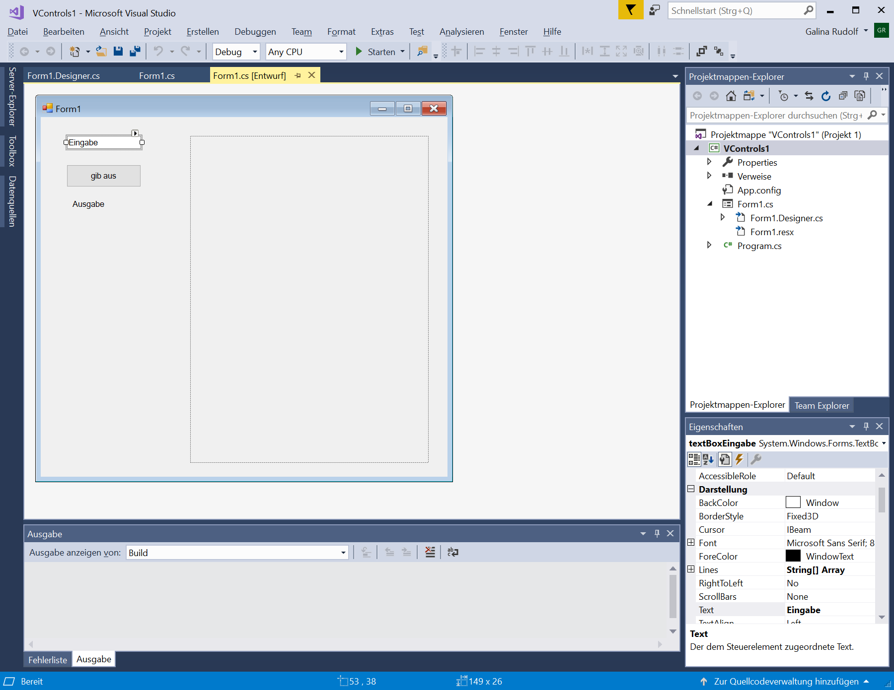
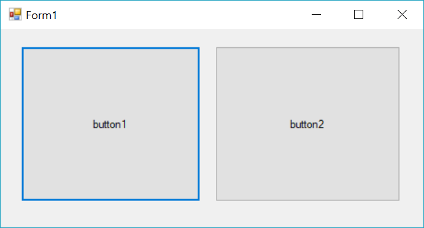
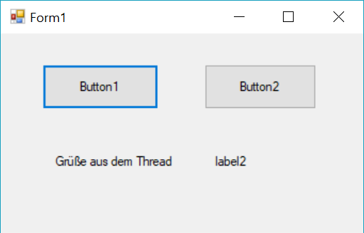
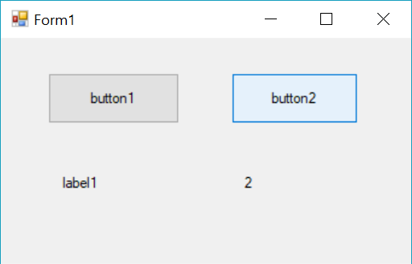
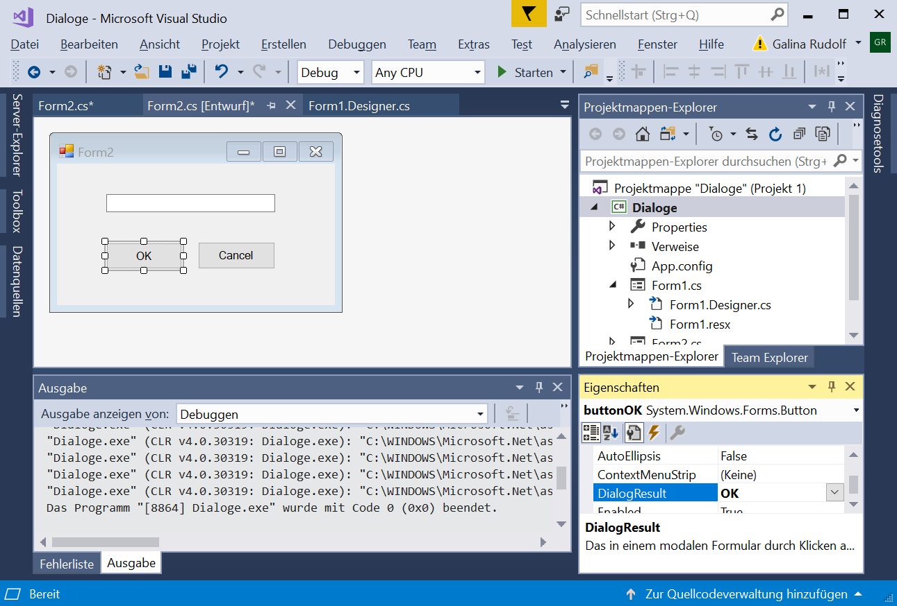
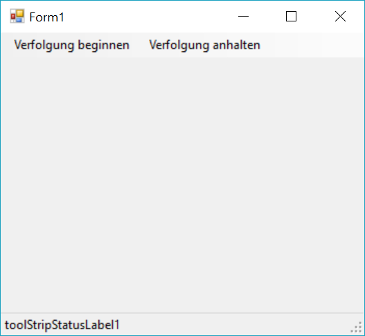
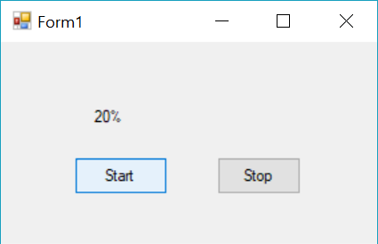

# Softwareentwicklung  Windows Forms

## GUI - graphical user interface

+ Grafische Benutzeroberfläche
+ Benutzerschnittstelle einer Anwendung

**Aufgabe:**
Anwendungen mittels grafischer Symbole, Steuerelemente (Widgets) über Maus, Tastatur bzw. durch Berührung eines Sensorbildschirms bedienbar zu machen

## Toolkit

+ eine Programmbibliothek, die zur GUI-Programmierung in Desktop-Anwendungen dient
+ ein „Werkzeugsatz“: stellt einen Satz von Steuerelementen (Widgets) inkl. Schnittstelle zur Systemumgebung  zur Verfügung
+ aber auch Entwicklungsumgebung, die das Gestalten grafischer Oberflächen vereinfachen

Quelle: [https://de.wikipedia.org/wiki/GUI-Toolkit](https://de.wikipedia.org/wiki/GUI-Toolkit)

Einige bekannte Toolkits
+ Qt
+ Swing, JavaFX (in Java)
+ Microsoft Foundation Classes (MFC)
+ Windows Presentation Foundation (WPF)
+ Windows Forms (.NET)

Windows Forms ist ein GUI-Toolkit des Microsoft .NET Frameworks. Es ermöglicht die Erstellung grafischer Benutzeroberflächen für Windows

## Windows Forms - Form
Die Formulare sind Grundelemente einer Anwendung.
Ein Formular ist „leere Fläche“, die
+ mit Steuerelementen (die vom Benutzer angesprochen werden), und
+ mit Code (wo die Eingaben verarbeitet werden)

erweitert wird.

Visual Studio bietet dazu eine integrierte Entwicklungsumgebung (IDE): Designer

### Minibeispiel

```C#
using System.Windows.Forms;
class MyForm:Form {}
static class Program
{
      [STAThread]
      public static void Main()
      {
          MyForm form = new MyForm();
          Label label = new Label();
          label.Text = "was gegen ein Label?";
          form.Controls.Add(label);
          Application.Run(form);
      }
}
```



**STAThreadAttribute** legt STA (Singlethreaded Apartment) als COM-Threadingmodell fest

mehr dazu:
[https://docs.microsoft.com](https://docs.microsoft.com/en-us/dotnet/api/system.stathreadattribute?redirectedfrom=MSDN&view=netframework-4.8)

### Application
Definition: **public sealed class Application**

Klasse **Application** stellt static-Methoden und Eigenschaften für die Verwaltung einer Anwendung zur Verfügung:
+ **Run**: startet eine Nachrichtenschleife einer Anwendung für den aktuellen Thread und wahlweise ein Formular an
+ **Exit** oder **ExitThread**: beendet eine Nachrichtenschleife
+ **DoEvents**: verarbeitet alle Windows-Meldungen, die sich derzeit in der Meldungswarteschlange befinden

### Form
**Form** stellt ein Fenster (ein Dialogfeld) dar

**Vererbungshierarchie**:
+ **Object**
+ **MarshalByRefObject** - ermöglicht den Zugriff auf Objekte über Anwendungsdomänen hinweg
+ **Component** - die Basisimplementierung für die IComponent-Schnittstelle (IComponent - stellt die für alle Komponenten erforderliche Funktionalität bereit)
+ **Control** - definiert die Basisklasse für visuelle Steuerelemente
+ **ScrollableControl** - definiert eine Basisklasse für Steuerelemente mit automatischem Bildlauf
+ **ContainerControl** - stellt Verwaltungsfunktionen für Container-Steuerelemente bereit
+ **Form**

### Controls und ContainerControls


+ **Control** sind sichtbare Komponenten (**Component**), und es gibt auch unsichtbare
+ **ContainerControl** sind Container, die Controls verwalten  

### Controls
**Namespace**: System.Windows.Forms

**Assembly**: System.Windows.Forms.dll

Controls (durch gleichnamige Klassen repräsentiert):
 
TextBox, Label, LinkLabel, Button, CheckBox, RadioButton, ListBox, ComboBox, ListView, TreeView, DateTimePicker, MonthCalendar, PictureBox, ProgressBar, WebBrowser
Timer
Panel, SplitContainer,
MenuStrip, ToolStrip

... und viele weitere

Controls Eigenschaften (Properties):
 
Location
Name
Text
Size

... und viele weitere

### Koordinatensystem

### Designer


+ ermöglicht schnelles Hinzufügen von Elementen in die Form
+ ermöglicht das Ändern aller relevanten Properties im Eigenschaften-Fenster
+ genaue Positionierung der Elemente möglich

## Erstellen einer Windows-Forms-Application

### Projektwahl

+ Forms-App (.NET Framework)
+ Forms-App (.NET Core)

Verwenden Sie .NET Core, wenn:

+ Es bestehen plattformübergreifende Anforderungen.
+ Sie verwenden Docker-Container
+ ...

Verwenden Sie .NET Framework, wenn:

+ Sie verwenden für Ihre Anwendung derzeit .NET Framework (empfohlen wird eine Erweiterung anstelle einer Migration).
+ Ihre Anwendung verwendet .NET-Technologien, -Bibliotheken, -NuGet-Pakete, die für .NET Core nicht verfügbar sind.
+ Ihre Anwendung verwendet eine Plattform, die .NET Core nicht unterstützt. Windows, macOS und Linux unterstützen .NET Core.

Mehr dazu unter [https://docs.microsoft.com](https://docs.microsoft.com/de-de/dotnet/standard/choosing-core-framework-server)

### Erzeugter Code

+ Form1.cs
+ Form1.Designer.cs
+ Program.cs

Form1.cs:

```c#
using System;
using System.Windows.Forms;
 
namespace WindowsFormsApp1
{
    public partial class Form1 : Form
    {
        public Form1()
        {
            InitializeComponent();
        }
    }
}
```
Mit **partial** ist es möglich, die Definition einer Klasse, einer Struktur, einer Schnittstelle oder einer Methode auf zwei oder mehr Quelldateien aufzuteilen.

**InitializeComponent** wird vom Designer erzeugt und betreut.

Form1.Designer.cs:

```C#
namespace WindowsFormsApp1
{
    partial class Form1
    {
        private System.ComponentModel.IContainer components = null;

        protected override void Dispose(bool disposing)
        {
            if (disposing && (components != null))
            {
                components.Dispose();
            }
            base.Dispose(disposing);
        }

        #region Windows Form Designer generated code
        private void InitializeComponent()
        {
            this.components = new System.ComponentModel.Container();
            this.AutoScaleMode = System.Windows.Forms.AutoScaleMode.Font;
            this.ClientSize = new System.Drawing.Size(800, 450);
            this.Text = "Form1";
        }
        #endregion
    }
}
```

**Dispose** gibt die von Component verwendeten nicht verwalteten Ressourcen und optional die verwalteten Ressourcen frei.

Nächste Scritte:
+ Steuerelemente hinzufügen (Ansicht ->Toolbox)
+ Eigenschaften ändern
+ Kompilieren
+ Ausführen

### Midibeispiel

VControls1-Projekt




## Ereignisbehandlung

###  Ereignis (Event)

Ein Ereignis ist eine Aktion, die im Quellcode „behandelt“ werden soll.
Ereignisse werden
+ durch eine Benutzeraktion generiert z. B. durch Klicken mit der Maus oder Drücken auf eine Taste
+ oder durch das System ausgelöst.

Jedes Steuerelement (auch Formular) verfügt über eine vordefinierte Gruppe von Ereignissen. Wenn eines dieser Ereignisse auftritt und Code im zugeordneten Ereignishandler vorhanden ist, wird der Code aufgerufen.

### Ereignishandler

Ereignishandler ist eine Methode, die auf ein Ereignis gebunden ist. Wenn das Ereignis ausgelöst wird, wird der Code innerhalb des Ereignishandlers ausgeführt.

Jeder Ereignishandler enthält zwei Parameter:

+ **sender**:  ein Verweis auf das Objekt, das das Ereignis ausgelöst hat
+ **e**: 	       enthält Ereignisbezogene Informationen wie z. B. die Position des Mauszeigers für Mausereignisse

```C#
private void buttonGibAus_Click(object sender, EventArgs e)
{
}
```

Ereignishandler kann innerhalb Designer-Ansicht schnell erzeugt werden
+ durch das doppelte Mausklick auf das Steuerelement
+ oder im Property-Fenster eingetragen werden

Das Ereignismodell verwendet Delegaten um Ereignisse an die Methoden zu binden.

```c#
this.buttonGibAus.Click +=
           new System.EventHandler(this.buttonGibAus_Click);

private void buttonGibAus_Click(object sender, EventArgs e)
{
    this.labelAusgabe.Text=this.textBoxEingabe.Text;
    this.pictureUnpassend = Image.FromFile("Bild.jpg");
}
```
Beim erstellen vom Eregnishandler registriert Designer sie automatisch für die entsprechenden Events.

### Systemereignisse

Die Klassen Form und Control stellen einen Satz von Ereignissen bereit, die sich auf das Starten von Anwendungen beziehen:
+ Control.HandleCreated
+ Control.BindingContextChanged
+ Form.Load
+ Control.VisibleChanged
+ Form.Activated
+ Form.Shown

Sie werden ausgelöst in genau dieser Reihenfolge.

Beim Schließen einer Windows Forms-Anwendung werden die Ereignisse in der folgenden Reihenfolge ausgelöst:
+ Form.Closing
+ Form.FormClosing
+ Form.Closed
+ Form.FormClosed
+ Form.Deactivate
+ Application.ApplicationExit

### Benutzeraktion

+ Mouse
+ Taste

Steuerelemente (inkl. Formular selbst) verfügen über zum Teil unterschiedliche, zum Teil gleiche Ereignisse (die meisten behandeln beispielsweise ein Click-Ereignis).

Achtung: Viele Ereignisse treten zusammen auf, z.B. DoubleClick, MouseDown, MouseUp und Click.

### Mouseereignisse

Wenn eine Maustaste gedrückt und wieder losgelassen wird, werden bei den meisten Steuerelementen in der angegebenen Reihenfolge ausgelöst:

+ MouseDown
+ Click
+ MouseClick
+ MouseUp

Bei einem Doppelklick mit der Maus werden ausgelöst:

+ MouseDown
+ Click
+ MouseClick
+ MouseUp
+ MouseDown
+ DoubleClick
+ MouseDoubleClick
+ MouseUp

### Key-Ereignissen

+ Das Drücken der Taste löst ein KeyDown aus.
+ Das Halten der Taste löst KeyPress-Ereignis aus, mehrmals, wenn der Benutzer eine Taste gedrückt hält.
+ Beim Loslassen der Taste tritt KeyUp-Ereignis auf.

### Beispiel

VControls2-Projekt:
zwei Button und Form haben Key- und MouseDown- Events



```C#
private void Form1_MouseDown(object sender, MouseEventArgs e)
        => Text = "Form - " + e.Location.ToString();
 
private void button1_MouseDown(object sender, MouseEventArgs e)
        => (sender as Button).Text = "Button - " + e.Location.ToString();

private void Form1_KeyPress(object sender, KeyPressEventArgs e)
        => MessageBox.Show("Form1 Key Press Event");
   
private void button1_KeyPress(object sender, KeyPressEventArgs e)
        => MessageBox.Show("Button1 Key Press Event");
 
private void button2_KeyPress(object sender, KeyPressEventArgs e)
        => MessageBox.Show("Button2 Key Press Event");
```

Aus dem Beispiel ist ersichtlich: der Empfänger eines Events ist immer vom jeweiligen Event abhängig:

+ MouseEvents: Event wird im Ziel ausgelöst (dort wo Mauszeiger ist)
+ KeyPress-Event (und auch Click): immer auf dem Element im Fokus

### Argumente der Eventhandler

#### **MouseEventArgs** Class (Object -> EventArgs->MouseEventArgs)

**Button** gib an, welche Maustaste gedrückt wurde

**Clicks** gib an, ob die Maustaste gedrückt und losgelassen wurde

**Location** ruft die Position der Maus während des Mausereignisses ab

**X** ruft die x-Koordinate der Maus während des Mausereignisses ab

**Y**	ruft die y-Koordinate der Maus während des Mausereignisses ab

#### **KeyEventArgs** Class (Object -> EventArgs->KeyEventArgs)

**Alt,Control, Shift** gibt an, ob ALT (STRG, SHIFT) gedrückt wurde

**Handled** gib an, ob das Ereignis behandelt wurde, oder legt diesen fest

**KeyCode** ruft den Tastaturcode ab (bei KeyDown oder KeyUp)

**KeyData** ruft die Tastendaten ab (bei KeyDown oder KeyUp)

**KeyValue** ruft den Tastaturwert ab (bei KeyDown oder KeyUp)

**SuppressKeyPress** gib an, ob das Key-Ereignis an das zugrunde liegende Steuerelement übergeben werden soll

### **KeyPressEventArgs** Class (Object -> EventArgs->KeyPressEventArgs)

**Handled** gib an, ob das KeyPress-Ereignis behandelt wurde, oder legt diesen fest

**KeyChar** ruft das Zeichen ab, das der gedrückten Taste entspricht, oder legt dieses fest

#### **object  sender**

VControl3-Projekt:
Beispiel für zwei Button aber einen Handler

```C#
this.button1.Click += new System.EventHandler(this.button_Click);
this.button2.Click += new System.EventHandler(this.button_Click);
 

private void button_Click(object sender, EventArgs e)
{
    if (sender.Equals(button1)) MessageBox.Show("Button1");
    if (sender.Equals(button2)) MessageBox.Show("Button2");
}
```

```C# 
this.button1.KeyPress += new System.Windows.Forms.KeyPressEventHandler(this.button_KeyPress);
this.button2.KeyPress += new System.Windows.Forms.KeyPressEventHandler(this.button_KeyPress);
 
private void button_KeyPress(object sender, KeyPressEventArgs e)
{
      switch (e.KeyChar)
      {
           case 'b': (sender as Button).BackColor = Color.Blue; break;
           case 'r': (sender as Button).BackColor = Color.Red; break;
      }
}
```

Beispiel: Nutzen der Handled-Property der KeyPressEventArgs um die mehrfache Ausführung zu verhindern.

```C#
private void Form1_KeyPress(object sender, KeyPressEventArgs e)
{
   switch (e.KeyChar)
   {
        case 'b':
            MessageBox.Show("Form: 'b'");
            e.Handled = true;
            break;
        case 'v':
            MessageBox.Show("Form: 'v'");
            e.Handled = true;
            break;
   }
}
```
## Multi-Threading

**Motivation**: Alles in der GUI wird von einem einzigen Thread ausgeführt.
Wenn der UI-Thread blockiert wird, friert die GUI ein.

Lösung: Multi-Threading

Beispiel: nach dem Button-Click gibt es viel zu tun

VControls4-Projekt



```C#
private void button1_Click(object sender, EventArgs e)
{
    Thread myThread = new Thread(new ThreadStart(myMethod));
         myThread.Start();
}
public void myMethod()
{
    Thread.Sleep(2000);
    string newText = "Grüße aus dem Thread";
    this.label1.Invoke((MethodInvoker) delegate {
    this.label1.Text = newText; //Running on the UI thread
    });
}
```
Die Control.Invoke()-Methode verendet als Argument delegate
System.Windows.Forms.MethodInvoker


Nachteil: Invoke blockiert die Ausführung, bis er abgeschlossen ist
(synchroner code).

Seit .NET 4.5 und C# 5.0 ist eine asynchrone Implementierung des Event-Handlers möglich (Task-based Asynchronous Pattern - TAP):

+ Schlüsselwort **async**
+ **Task** statt **Thread**

```C#
private async void button2_Click(object sender, EventArgs e)
{
   var progress = new Progress<string>(s => label2.Text = s);
   await Task.Factory.StartNew(() => SecondThread.LongWork(progress),
                                       TaskCreationOptions.LongRunning);
    label2.Text = "completed";
}
```

+ Methode Factory.StartNew erstellt und startet ein Task
+ Task beinhaltet die Methode LongWork mit dem Parameter Progress
+ Progress<T>(Action <T>) initialisiert Progress<T>-Objekt mit dem angegebenen Callback


Definition eines Threads, der den UI-thread informiert:

```C#
class SecondThread
{
    public static void LongWork(IProgress<string> progress)
    {
        //Perform a long running work...
        for (var i = 0; i < 10; i++)
        {
            Task.Delay(500).Wait();
            progress.Report(i.ToString());
        }
    }
}
```



[Quelle: https://im-coder.com/wie-aktualisiere-ich-die-gui-aus-einem-anderen-thread.html](https://im-coder.com/wie-aktualisiere-ich-die-gui-aus-einem-anderen-thread.html)

## Dialoge

Dialoge sind auch C#- Klassen mit Feldern, Eigenschaften und Methoden.

vordefinierte Dialoge: ColorDialog, FolderBrowserDialog, FontDialog, OpenFileDialog, SaveDialog

```C#
private void button1_Click(object sender, EventArgs e)
{
      //OpenFileDialog openFileDialog1=new OpenFileDialog();
      openFileDialog1.ShowDialog();
      label1.Text = openFileDialog1.FileName;
}
```

selbst definierte Dialoge:

+ sind auch nur von Form abgeleitete Klassen mit Steuerelementen
+ werden gehandhabt wie die vordefinierten

```C#
public partial class Form2 : Form
{
    public Form2()
    {
        InitializeComponent();
    }
}
```

```C#
private void button1_Click(object sender, EventArgs e)
{
      Form2 dialog=new Form2();
      dialog.ShowDialog();
      label1.Text = ?;
}
```

+ Button OK und Cancel



```C#
buttonOK.DialogResult = System.Windows.Forms.DialogResult.OK;
```

+ In der Dialog-Klasse muss der Zugriff auf die Felder (Eigenschaften) ermöglicht werden.

```C#
public string ZuÜbergeben
{
      get => textBox1.Text;
      set => textBox1.Text = value;
}
```

```C#
private void button1_Click(object sender, EventArgs e)
{
     Form2 dialog=new Form2();
     if (dialog.ShowDialog()==DialogResult.OK)
              label1.Text = dialog.ZuÜbergeben;
}
```

## Menüs und Symbolleisten

Menüs und Symbolleisten sind auch nur C#- Klassen mit Feldern, Eigenschaften, Ereignissen und Methoden

Vorhandene Menüs und Symbolleisten:

+ ContextMenuStrip, MenuStrip, StatusStrip, ToolStrip
+ können weitgehend mit Hilfe des Designers erzeugt werden
+ Ereignishandler müssen wie bei anderen Controls erstellt  und registriert werden

### Beispiel



Felder:

+ MenuStrip menuStrip1;
+ ToolStripMenuItem verfolgungBeginnenToolStripMenuItem;
+ ToolStripMenuItem verfolgungAnhaltenToolStripMenuItem;
+ StatusStrip statusStrip1;
+ ToolStripStatusLabel toolStripStatusLabel1;

```C#
menuStrip1.Items.AddRange(new ToolStripItem[] {
      verfolgungBeginnenToolStripMenuItem,
      verfolgungAnhaltenToolStripMenuItem});

statusStrip1.Items.AddRange(new ToolStripItem[] {
            toolStripStatusLabel1});

verfolgungBeginnenToolStripMenuItem.Click +=
            			new System.EventHandler(verfolgungBeginnenMenuItem_Click);

verfolgungAnhaltenToolStripMenuItem.Click +=
                			new System.EventHandler(verfolgungAnhaltenMenuItem_Click);

MouseMove += new System.Windows.Forms.MouseEventHandler(Form1_MouseMove);
MouseMove += new System.Windows.Forms.MouseEventHandler(Form1_MouseMove);
```

```C#
public partial class Form1 : Form
{
      public Form1()
      {
         InitializeComponent();
         Verfolgung = false;
      }

      private bool Verfolgung;

     private void Form1_MouseMove(object sender, MouseEventArgs e)
     {
        if (Verfolgung)
              	toolStripStatusLabel1.Text = e.X.ToString() + " " + e.Y.ToString();

      }

      private void verfolgungBeginnenMenuItem_Click(object sender, EventArgs e)
                              => Verfolgung = true;

      private void verfolgungAnhaltenMenuItem_Click(object sender, EventArgs e)
                              => Verfolgung = false;
}
```

## BackgroundWorker

Klasse BackgroundWorker: System.ComponentModel.Component

Namespace: System.ComponentModel

Aufgabe: führt einen Vorgang in einem getrennten Thread aus

### Ereignisse

**DoWork**: 	
+ startet und führt den asynchronen Vorgang aus
+ wird durch Aufruf von RunWorkerAsync()  ausgelöst
+ in der behandelnden Methode ist regelmäßig zu prüfen, ob der Vorgang gecancelt wurde

**ProgressChanged**:
+ aktualisiert den Status des Vorgangs (macht ihn für Benutzer sichtbar)
+ wird durch Aufruf von ReportProgress()  ausgelöst

**RunWorkerCompleted**:
+ tritt ein, wenn Vorgang beendet oder angebrochen wird

```C#
if (e.Error !=null) …
else if (e.Cancelled) …
else …
```

### Eigenschaften

**bool WorkerReportsProgress**:
fragt ab oder legt fest, ob Fortschrittaktualisierungen erlaub sind

**bool
WorkerSupportsCancellation**:
fragt ab oder legt fest ob asynchrone Abbrüche erlaubt sind

**bool IsBusy**:
fragt ab oder legt fest ob asynchroner Vorgang bereits ausgeführt wird

### Methoden

**RunWorkerAsync()**:
löst DoWork aus und startet damit den asynchronen Vorgang

**CancelAsync()**:
beendet die Ausführung

**ReportProgress()**:
löst ProgressChanged-Ereignis aus



Konstruktor:

```C#
backgroundWorker1.WorkerReportsProgress = true;
backgroundWorker1.WorkerSupportsCancellation = true;
```

Click von Start-Button:

```C#
 if (backgroundWorker1.IsBusy != true)
			backgroundWorker1.RunWorkerAsync();
```

Click von Stop-Button:

```C#
if (backgroundWorker1.WorkerSupportsCancellation == true)
			backgroundWorker1.CancelAsync();
```

```C#
private void backgroundWorker1_DoWork(object sender, DoWorkEventArgs e)
{
   for (int i = 1; i <= 10; i++)
   {
          if ((sender as BackgroundWorker).CancellationPending == true)
          {
               e.Cancel = true;
               break;
          }
          else
          {
      System.Threading.Thread.Sleep(500);
               worker.ReportProgress(i * 10);
          }
    }
}

private void backgroundWorker1_ProgressChanged(object sender,
					ProgressChangedEventArgs e) =>
      label1.Text = (e.ProgressPercentage.ToString() + "%");

private void backgroundWorker1_RunWorkerCompleted(object sender,
					RunWorkerCompletedEventArgs e)
{
      if (e.Cancelled == true)
			label1.Text = "Canceled!";
      else if (e.Error != null)
			label1.Text = "Error: " + e.Error.Message;
      else
          		label1.Text = "Done!";
 }
```
## Nicht behandelt

+ Die Einzelheiten zu den Controls
+ Paint-Event und Zeichnen
+ …
